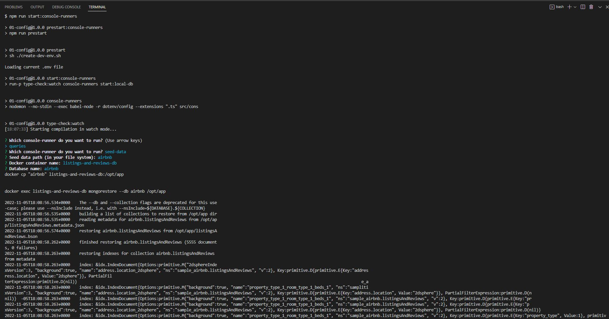
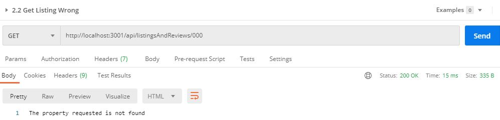

# Table of Contents
1. [Requirements](#requirements)
2. [Solution structure](#structure)
3. [URI design](#design)
4. [How to switch between mock and mongoDb mode](#mode)
5. [Steps to build, test and run it](#steps)
6. [How to test it](#howto)

<a name="requirements"></a>
## 1. Requirements
1. Install and configure the proper libraries that will be used in the project: Express, TypeScript, Babel, etc.

2. Structure your backend project using pods. Pods (Product Oriented Delivery) are a way of structuring your project by feature, instead of type. Instead of having a directory structure with several types (controllers, models, templates...), everything is grouped around a feature (comments, posts...).

3. Expose three endpoints:

   * Get a list of houses with the country as an optional filter.
   * Get the details of a house. Once a house is selected, it will get its details, specifically title, image, description, address, number of bedrooms, number of bathrooms and a list of the last five reviews.
   * Add a review: Name and review. Each time you add a new review, the date is generated automatically.

For each endpoint, return only the relevant fields that will be used by the front application (clue: Api Model <-> mapper <-> Model)

Implement the endpoints in mock mode.
Implement the endpoints with MongoDB (using the mongo driver).

Add unit tests of the mappers and helpers files.

Add pagination to the enpdoint that gets list of houses.

<a name="structure"></a>
## 2. Solution structure

```
├── airbnb
├── 1.essential
│   ├── config/test
│   ├── images
│   ├── public
│   ├── src
│   	├── common/middlewares
│   	├── console-runners
│   	├── core
│   	├── dals
│   	├── pods/listingAndReviews
│   	├── app.ts
│   	├── index.ts
├── .babelrc
├── .editorconfig
├── .env
├── .env.test
├── .gitignore
├── .create-dev-env.sh
├── docker-compose.yml
├── Listing_And_Reviews_Rest_Api_LemonCode.postman_collection.json
├── package-lock.json
├── package.json
├── README.md
├── tsconfig.json
```

<a name="design"></a>
## 3. URI design

|HTTP Method  |  Resource | Description |
| ----------  |---------  | ------  |
|GET | `/listingsAndReviews?country=Spain&page=1&pageSize=10` |Get list of listings|
|GET | `/listingsAndReviews/:id`|Get a listing |
|POST| `/listingsAndReviews` | Add a review |

<a name="mode"></a>
## 4. How to switch between mock and mongoDb mode


### Mock Mode 
Make sure the API_MOCK environment variable is `true` in the `.env` file in the root directory of this project: `API_MOCK=true`

### MongoDb Mode
`API_MOCK=false`

In the root directory of this repository there is an "airbnb" folder with the airbnb sample MongoDB database. You could also find it [here](https://www.mongodb.com/docs/atlas/sample-data/). In order to restore it to our Docker container that runs the Mongo image, you need to run the following command: `npm run start:console-runners`. Then you need to select `seed-data` and enter the following information:

>> Seed data path: `../airbnb`
>> Docker container name: `listings-and-reviews-db`
>> Database name: `airbnb`

Seed data path: path in your file system 
Docker container name: you can see this name in docker-compose.yml file. 
Database name: you can see this name in .env.example or .env files.



<a name="steps"></a>
## 5. Steps to build, test and run the rest api
Install app: `npm install`

Run specs:

`npm run test:watch`

`npm run test:watch listingAndReviews.mappers`

`npm run test:watch listingAndReviews.rest-api`

Run app: `npm start`

<a name="howto"></a>
## 6. How to test it
To create the requests for the methods we could use Postman or similar app.

You can find the Postman requests collection [here](Listing_And_Reviews_Rest_Api_LemonCode.postman_collection.json).

* Requests to get a list of houses with the country as an optional filter:

   * URL: `http://localhost:3001/api/listingsAndReviews?country=Spain&page=1&pageSize=10`

      

   * URL: `http://localhost:3001/api/listingsAndReviews?page=1&pageSize=10`
      

   * URL: `http://localhost:3001/api/listingsAndReviews`
      

   * URL: `http://localhost:3001/api/listingsAndReviews?country=Spain`
      

   * URL: `http://localhost:3001/api/listingsAndReviews?country=sSpain`
      

* Requests to get the details of an existing a non existing house:
   * URL: `http://localhost:3001/api/listingsAndReviews/10545725`
      
   
   * URL: `http://localhost:3001/api/listingsAndReviews/000`
      

* Request to add a new review for the "10545725" listing:
   * URL: `http://localhost:3001/api/listingsAndReviews`
   * BODY:
      ```
      {
         "comments": "Really nice flat 13",    
         "reviewer_name": "Maria",
         "listing_id": "10545725"
      }
      ```
      
      
      In the following picture you can see that the review has been added into 10545725 listing and it's displayed the first one because is the newest one. 
      

Here, you can see all the requests made:


