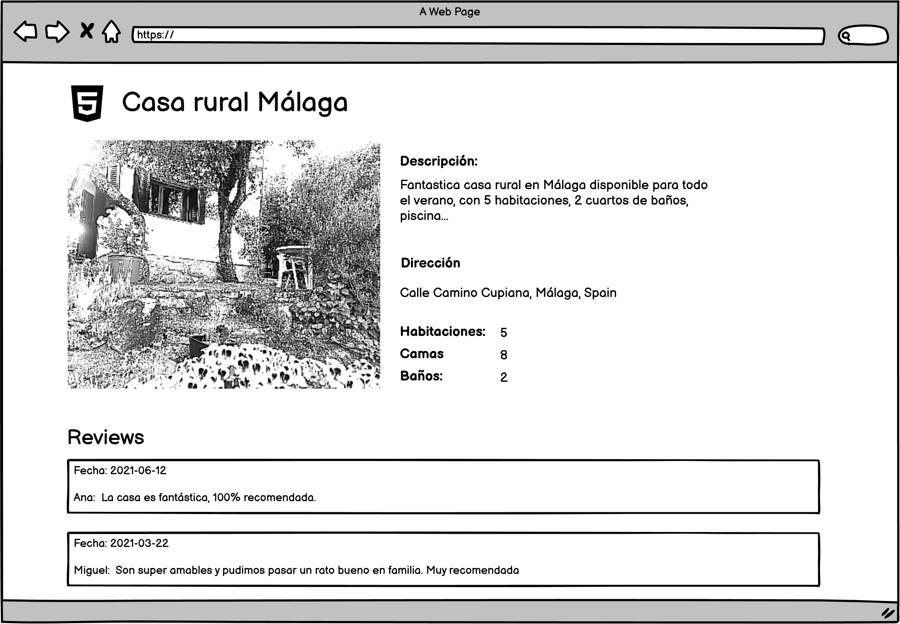

# Introduction
This repository presents the solution to the exercise provided by the Bootcamp Backend Lemoncode for the Module 4 - Rest Api.
The tech stack for this application is Node.js / Express.js API that uses Babel with Typescript.

# Rest api rentals exercise
Implement a backend application for a holiday house's rentals portal, where there are two pages:
* List holiday houses
  
  In this page, it will be requested to the backend app a list of the available vacation houses per country.
* Holiday house details
  
  Once a house is selected, it will get its details, specifically title, image, description, address, number of bedrooms, number of bathrooms and a list of the last five reviews.

## Pre requirement
## Restore backup

Restore an airbnb database. You can find it in this link: https://drive.google.com/drive/folders/1gAtZZdrBKiKioJSZwnShXskaKk6H_gCJ?usp=sharing

You could follow the following instructions: https://www.lemoncode.tv/curso/docker-y-mongodb/leccion/restaurando-backup-mongodb

You can find a sample in this link: https://www.mongodb.com/docs/atlas/sample-data/sample-airbnb/

Please, remember to check whether there are any previous backups in opt/app that you would need to delete.