# Table of Contents
1. [Requirements](#requirements)
2. [Solution structure](#structure)
3. [URI design](#design)
4. [Steps to install, restore and start it](#steps)
5. [How to switch between mock and mongoDb mode](#mode)
6. [How to test it](#howto)
6. [How to run the unit tests](#unittest)
7. [How to run the integration tests](#integrationtest)

<a name="requirements"></a>
## 1. Requirements

1. Install and configure the libraries that will be used in the project: Express, TypeScript, Babel, etc.

2. Structure your backend project using pods. Pods (Product Oriented Delivery) are a way of structuring your project by feature, instead of type. Instead of having a directory structure with several types (controllers, models, templates...), everything is grouped around a feature (comments, posts...).

3. For a holiday house's rentals portal implement a backend application that exposes the following endpoints:

   1. Get a list of houses with the country as an optional filter. (must)
      Front End "List holiday houses" page:
            
   2. Get the details of a house. Once a house is selected in the front end, it will get its details, specifically title, image, description, address, number of bedrooms, number of bathrooms and a list of the last five reviews. (must)
      Front End "Holiday house details" page:
      
   3. Add a review: Name and review. Each time you add a new review, the date is generated automatically. (must)
   4. Add an endpoint for the login. The login workflow is implemented using cookies. (challenge)
   5. Add an endpoint to update the detail of a listing. (challenge)

4. Also, implement the following funcionality:

   * For each endpoint, return only the relevant fields that will be used by the front application (clue: Api Model <-> mapper <-> Model). (must)

   * Implement the endpoints in mock mode and with MongoDB, using the mongo driver. (must)

   * Add unit tests of the mappers and helpers files. (must)

   * Add pagination to the enpdoint that gets list of houses. (must)

   * Secure the "Update the detail of a listing" endpoint so that only an admin user can use it. (challenge)

   * Add integration tests of some endpoint. (challenge)

   * Create a new branch in the repository: mongoose and implement the version with Mongoose. (challenge)

   * Create a console runner to restore the airbnb backup. (challenge)

<a name="structure"></a>
## 2. Solution structure

```
├── airbnb
├── 1.essential
│   ├── config\test
│   ├── images
│   ├── public
│   ├── src
│   	├── common\helpers (challenge)
│   	├── common\middlewares
│   	├── common-app\models (challenge)
│   	├── console-runners
│   	├── core
│   	├── dals\listingAndReviews
│   	├── dals\user  (challenge)
│   	├── pods\listingAndReviews
│   	├── pods\security (challenge)
│   	├── app.ts
│   	├── index.ts
├── .babelrc
├── .editorconfig
├── .env
├── .env.test
├── .gitignore
├── .create-dev-env.sh
├── docker-compose.yml
├── global-types.d.ts
├── Listing_And_Reviews_Rest_Api_LemonCode.postman_collection.json 
├── package-lock.json
├── package.json
├── README.md
├── tsconfig.json
```

<a name="design"></a>
## 3. URI design

|HTTP Method  |  Resource | Description |
| ----------  |---------  | ------  |
|POST| `/security/login` | Login |
|GET | `/listingsAndReviews?country=Spain&page=1&pageSize=10` | Get list of listings|
|GET | `/listingsAndReviews/:id`|Get a listing |
|PUT| `/listingsAndReviews/:id/reviews` | Add a review |
|PUT| `/listingsAndReviews/:id` | Update a listing and its reviews |
|POST| `/listingsAndReviews` | Insert a listing and/or its reviews |

<a name="steps"></a>
## 4. Steps to install, restore and start it

* Install app: `npm install`

* Restore airbnb database

   In the root directory of this repository there is an "airbnb" folder with the airbnb sample MongoDb database. You could also find it [here](https://www.mongodb.com/docs/atlas/sample-data/). In order to restore it to your Docker container that runs the Mongo image, you need to run the following command: `npm run start:console-runners`. Then you need to select `seed-data` and enter the following information:

   >> Seed data path: `../airbnb`
   >> Docker container name: `listings-and-reviews-db`
   >> Database name: `airbnb`

   Seed data path: path in your file system 
   Docker container name: you can see this name in docker-compose.yml file. 
   Database name: you can see this name in .env.example or .env files.

   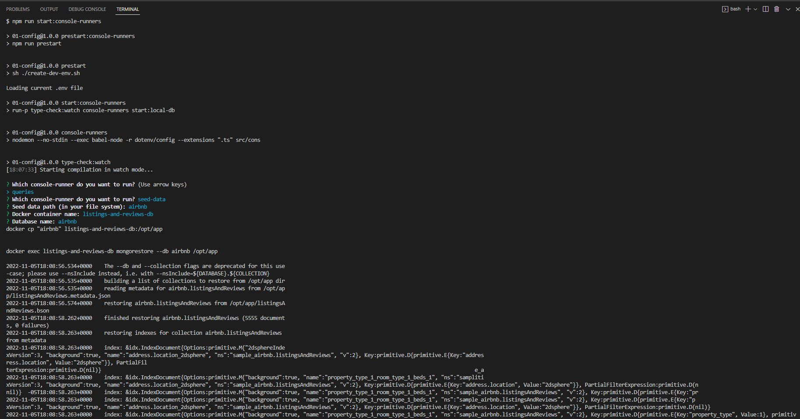
   
   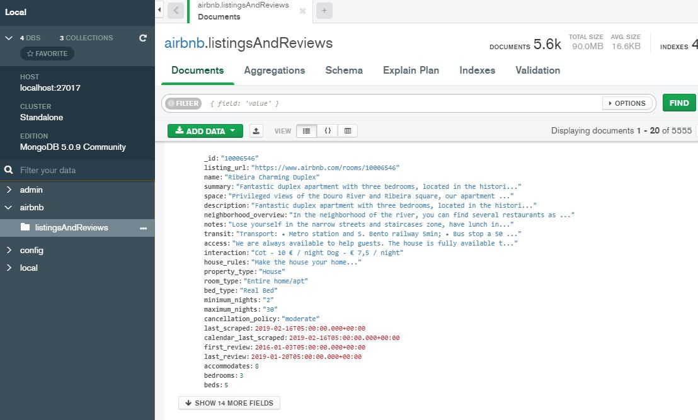

   You could also follow the following instructions: https://www.lemoncode.tv/curso/docker-y-mongodb/leccion/restaurando-backup-mongodb
   Please, remember to check whether there are any previous backups in opt/app that you would need to delete.
* Run app: `npm start`

<a name="mode"></a>
## 5. How to switch between mock and mongoDb mode

### Mock Mode 
Make sure the API_MOCK environment variable is `true` in the `.env` file in the root directory of this project: `API_MOCK=true`

### MongoDb Mode
`API_MOCK=false`

Note that if `.env` file does not exist, the create-dev-env.sh script will create it from `.env.example` file.

<a name="howto"></a>
## 6. How to test it
To create the requests for the end points we could use Postman or similar app.

You can find the Postman requests collection [here](Listing_And_Reviews_Rest_Api_LemonCode.postman_collection.json).

* Request to login:
   * URL: `POST http://localhost:3001/api/security/login`
   * BODY:
      ```
      {
	      "email": "admin@email.com",
	      "password": "test"
      }
      ```
   We should install Postman interceptor to check cookies on postman. With cookies we could check it on browser too.

   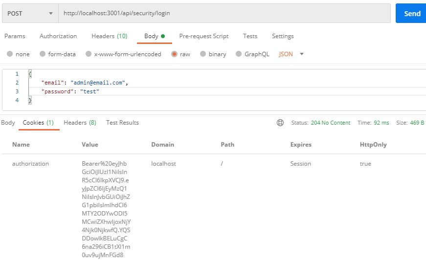
   
   What is cookies in response?
   The response cookie are the cookies that you want to place in the browser. The next connection from the browser that accepted the cookie from the response object will provide the cookie in the request object.
   >> Headers
      Authorization: Bearer my-token
   
   Check [jwt](https://jwt.io) information:
   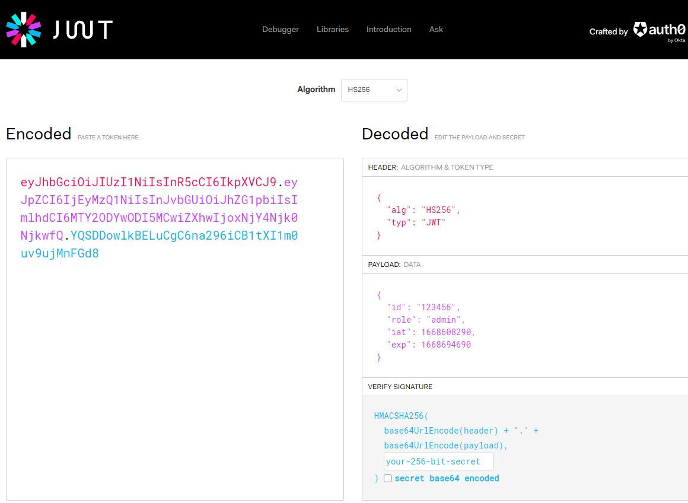
 
## Headers
Authorization: Bearer my-token
 
* Requests to get a list of houses with the country as an optional filter. These requests can be used by either an Standard or Admin user:

   * URL: `GET http://localhost:3001/api/listingsAndReviews?country=Spain&page=1&pageSize=10`

      

   * URL: `GET http://localhost:3001/api/listingsAndReviews?page=1&pageSize=10`
      

   * URL: `http://localhost:3001/api/listingsAndReviews`
      

   * URL: `GET http://localhost:3001/api/listingsAndReviews?country=Spain`
      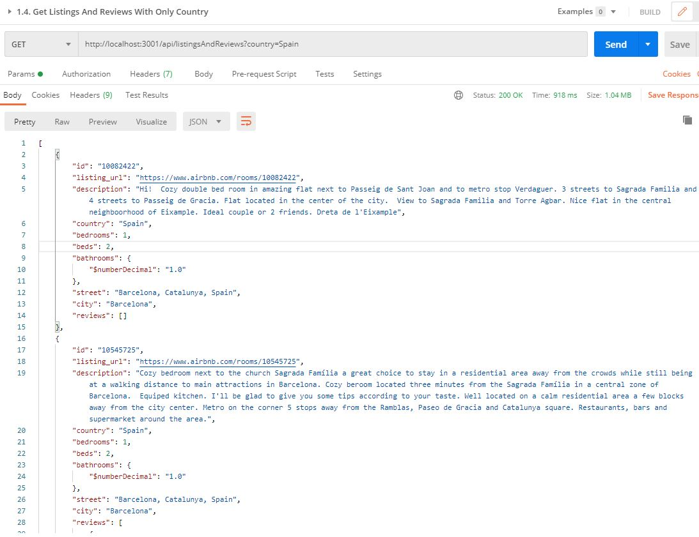

   * URL: `GET http://localhost:3001/api/listingsAndReviews?country=sSpain`
      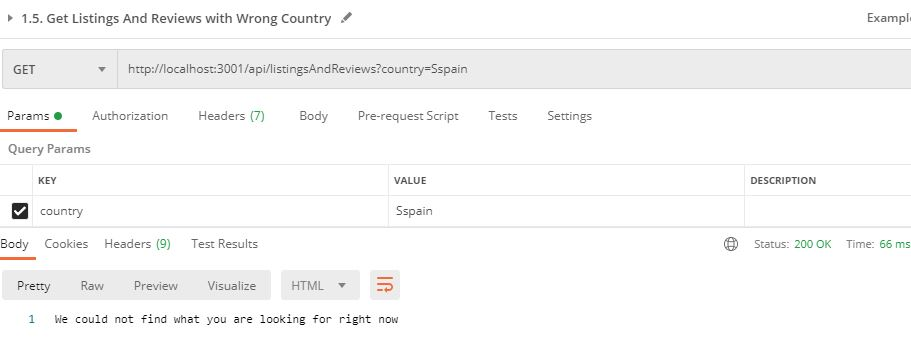

* Request to get the details of an existing house:
   * URL: `GET http://localhost:3001/api/listingsAndReviews/10545725`
      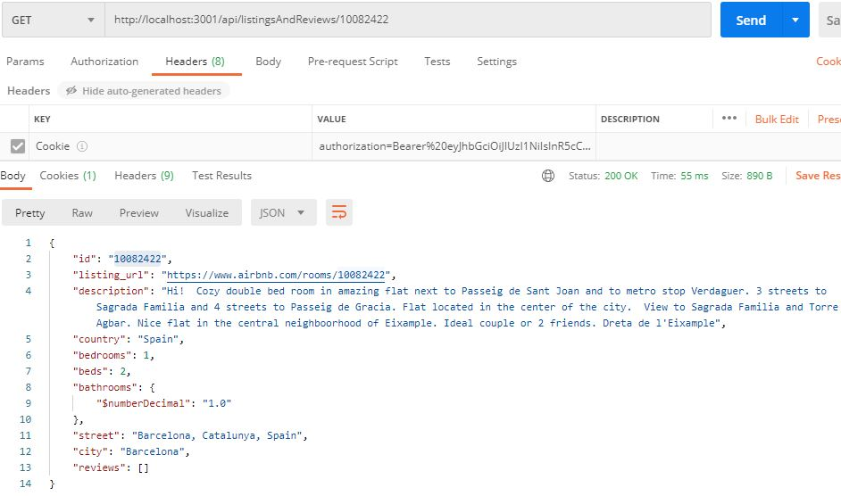
   
* Requests to get the details of a non existing house:
   * URL: `GET http://localhost:3001/api/listingsAndReviews/000`
      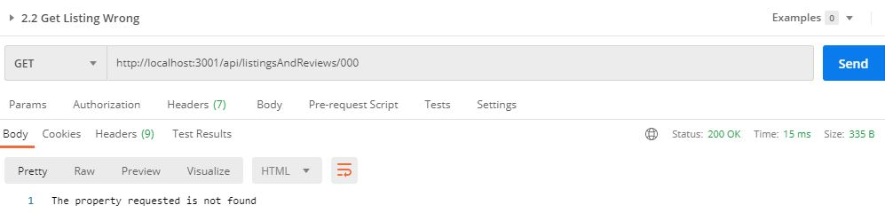

* Request to add a new review for the "10545725" listing. This request can be used by either an Standard or Admin user:
   * URL: `PUT http://localhost:3001/api/listingsAndReviews/10545725/reviews`
   * BODY:
      ```
      {
         "comments": "Really nice apartment 3",
         "reviewer_name": "Marina",
         "listing_id": "10545725"
      }
      ```
      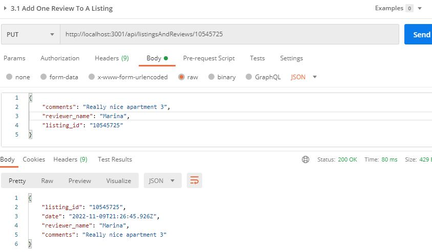
      
      The date has been created automatically. In the following picture you can see that the review has been added into 10545725 listing and it's displayed the first one because is the newest one.   
      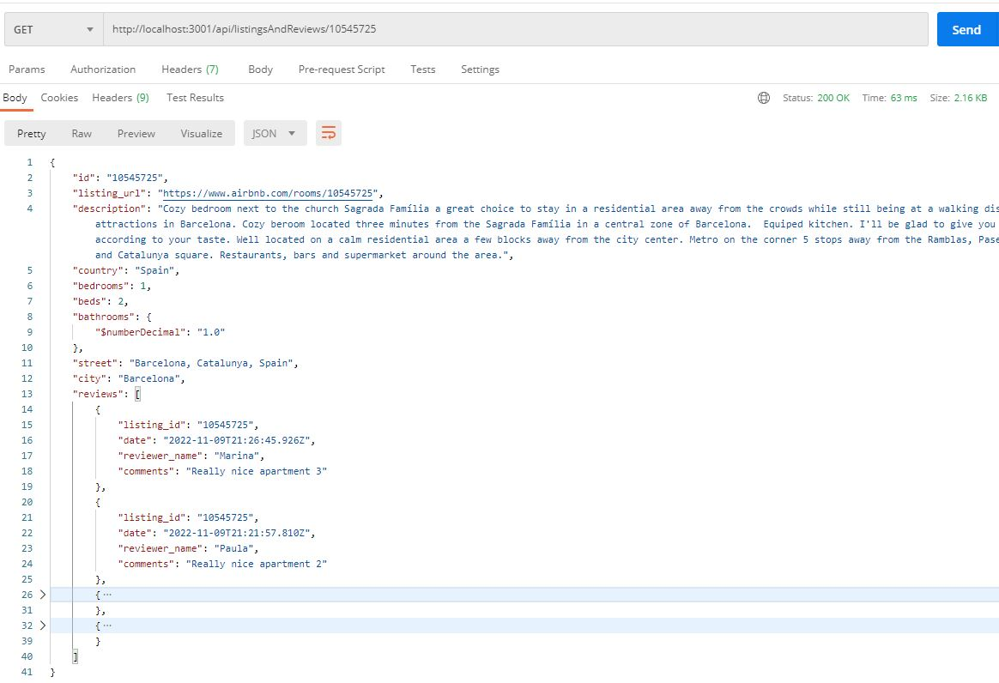

* Request to update an existing house, e.g. "10082422". This request can be used only by an Admin user:
   * URL: `PUT http://localhost:3001/api/listingsAndReviews/10545725`
   * BODY:
      ```
      {
         "id": "10082422",
         "listing_url": "https://www.airbnb.com/rooms/10082422",
         "description": "Update - Hi!  Cozy double bed room in amazing flat next to Passeig de Sant Joan and to metro stop Verdaguer. 3 streets to Sagrada Familia and 4 streets to Passeig de Gracia. Flat located in the center of the city.  View to Sagrada Familia and Torre Agbar. Nice flat in the central neighboorhood of Eixample. Ideal couple or 2 friends. Dreta de l'Eixample",
         "country": "Spain",
         "bedrooms": 1,
         "beds": 2,
         "bathrooms": 1,
         "street": "Update - Barcelona, Catalunya, Spain",
         "city": "Barcelona",
         "reviews": [
            {           
                  "reviewer_name": "Marta",
                  "comments": "Nice apartment",
                  "listing_id": "10082422"
            }
         ]
      }
      ```
      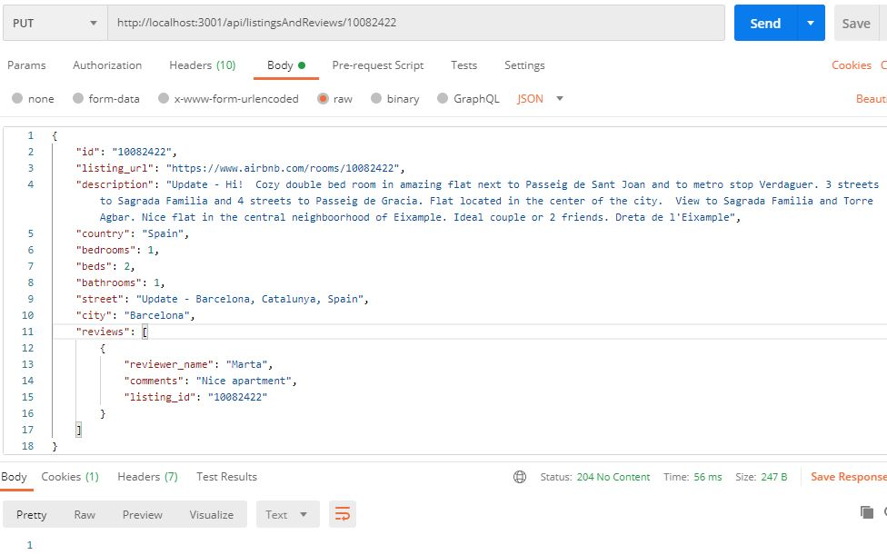

      In the following picture you can see that the listing has been updated and one review has been added too.   
      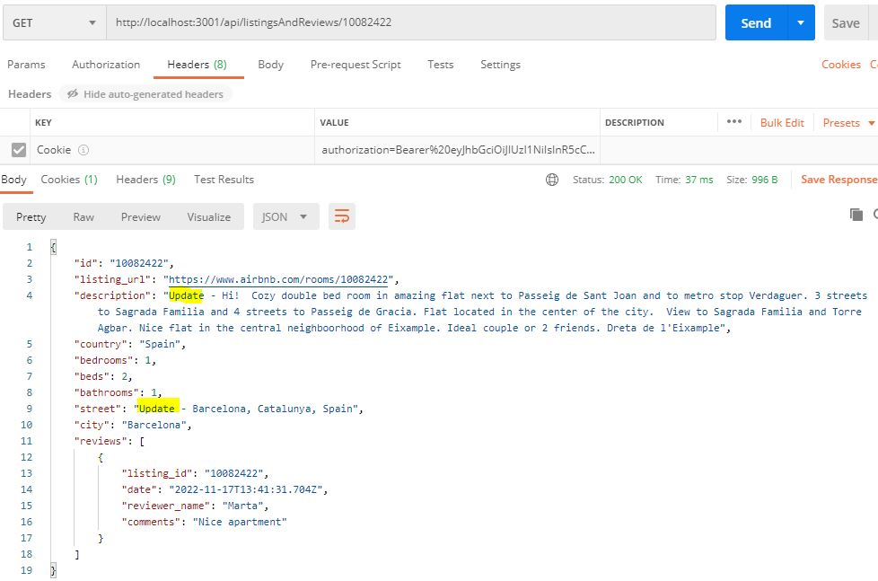
      
      If an standard user tries to update a listing, the api will not allow to update it, and the response will be "Forbiden" (403).
       
       
* Request to insert a house. This request can be used only by an Admin user:
   * URL: `POST http://localhost:3001/api/listingsAndReviews`
   * BODY:
      ```
      {
         "id": "10545726",
         "listing_url": "new url",
         "description": "new description",
         "country": "Spain",
         "bedrooms": 1,
         "beds": 1,
         "bathrooms": 1,
         "street": "street",
         "city": "Cuenca",
         "reviews": [
            {           
                  "reviewer_name": "Monica",
                  "comments": "New Very Nice flat",
                  "listing_id": "10545726"
            }
         ]
      }
      ```
      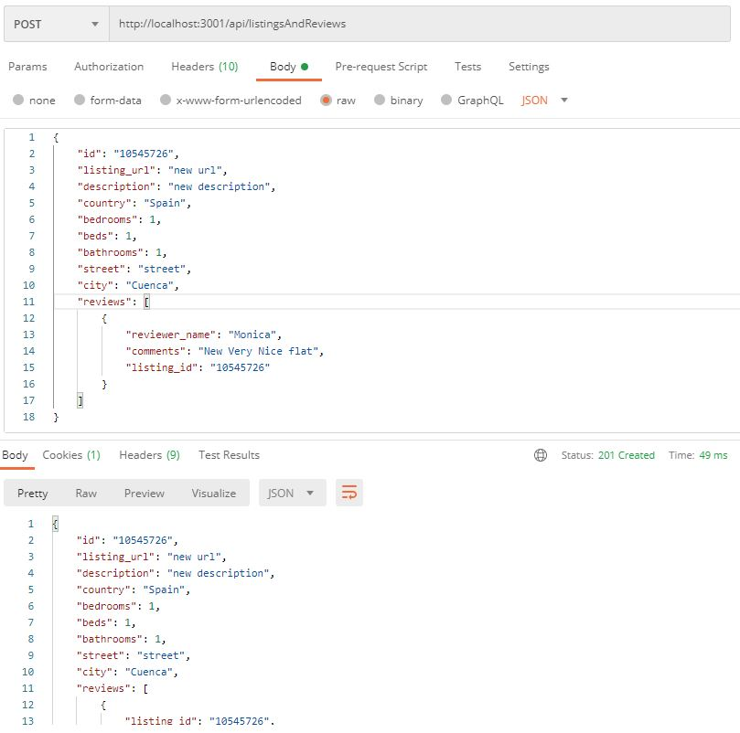

Here, you can see some of the requests made:

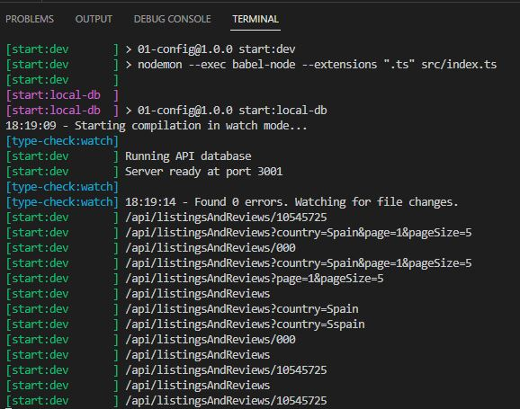

<a name="unittest"></a>
## 7. How to run the unit tests

I've used [Jest Framework](https://jestjs.io/) to add unit tests of the `listingAnReviews.mappers.ts` file. Jest is a Javascript Testing framework built by Facebook.

### Debugging Jest
Since jest is a nodejs process, you could use the integrated JavaScript Debug Terminal provided by VS Code.

You could run all specs as single run in this terminal and adding some breakpoints with this command: `npm test`

Run unit tests in watch mode:

`npm run test:watch`

`npm run test:watch listingAndReviews.mappers`

<a name="integrationtest"></a>
## 8. How to run the integration tests
I've used [supertest](https://github.com/visionmedia/supertest) to add integration tests of the `listingAndReviews.rest-api.ts` file. In this file I have added integration test of these two endpoints:
* getListingAndReviewsList
* getListingAndReviews

Supertest needs the app express instance to do a mock request. The `.env.test` file is a custom environment file for tests:
```
NODE_ENV=development
PORT=3001
STATIC_FILES_PATH=../public
CORS_ORIGIN=*
CORS_METHODS=GET,POST,PUT,DELETE
API_MOCK=true
MONGODB_URI=mongodb://localhost:27017/airbnb
```

Run integration tests in watch mode:
`npm run test:watch listingAndReviews.rest-api`

To test this repository implementation with a MongoDB memory database, please have a look [here](https://github.com/Lemoncode/bootcamp-backend/tree/main/00-stack-documental/04-rest-api/07-testing/06-integration-tests)
